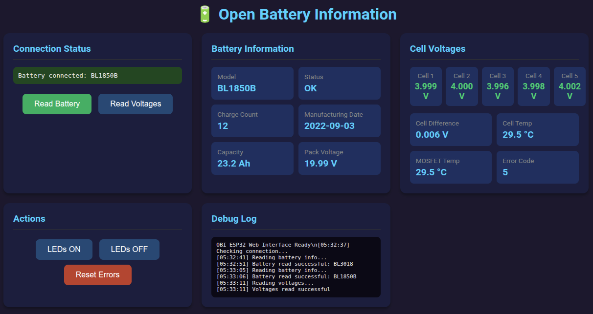
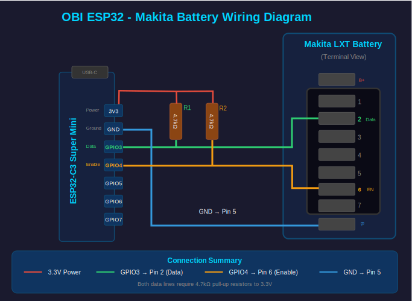

# OBI ESP32 - Open Battery Information

An ESP32-C3 port of the [Open Battery Information](https://github.com/mnh-jansson/open-battery-information) project by Martin Jansson.

This firmware provides a web-based interface for reading Makita LXT battery information, including cell voltages, temperatures, charge cycles, and error codes.



## Features

- **Web Interface**: Responsive single-page application accessible from any browser
- **Real-time Battery Data**: Cell voltages, pack voltage, temperatures, charge count
- **mDNS Discovery**: Access via `http://obi-esp32.local`
- **OTA Updates**: Wireless firmware updates after initial flash
- **REST API**: JSON endpoints for integration with other systems
- **Dual Temperature Sensors**: Cell thermistor and MOSFET temperatures

## Hardware Requirements

### Bill of Materials

| Component | Quantity | Notes |
|-----------|----------|-------|
| ESP32-C3 Super Mini | 1 | Any ESP32-C3 board with native USB should work |
| 4.7kΩ Resistor | 2 | Pull-up resistors for data lines |
| Makita LXT Battery | 1 | 18V batteries (BL18xx series) |
| Connecting wires | 4 | For battery connections |
| Makita charger connector | 1 | See below for links to a source on aliexpress |
 
### Enclosure

A 3D printed enclosure designed for the original Arduino-based OBI works well with this ESP32 version:

- **Enclosure**: [Makita 18V Battery Unlock Device (OBI)](https://makerworld.com/en/models/2087559-makita-18v-battery-unlock-device-obi#profileId-2256293) on MakerWorld
- **ESP32 Wedge**: [ESP32-C3 Super Mini holder](https://cad.onshape.com/documents/c5aa6404e5114fbe73d30d6f/w/0a86b12236fd063c60bf388b/e/192fc2f6005dd903a32d98f6) - small wedge to secure the ESP32 in place

The enclosure was designed for the Arduino Nano but accommodates the ESP32-C3 Super Mini with the addition of the wedge adapter.

### Parts Sources

These parts were used in the [OBI build video](https://www.youtube.com/watch?v=kUg9jWvf5FM):

| Part | Link |
|------|------|
| Arduino Nano (or use ESP32-C3) | [AliExpress](https://shorturl.at/CDrs5) |
| Makita charger connector | [AliExpress](https://shorturl.at/FXyoS) |
| Spade terminals | [AliExpress](https://shorturl.at/iqGX7) |
| 4.7kΩ 0.25W resistors | [AliExpress](https://shorturl.at/FKcI7) |

If the link to the Makita charger connector doesn't work, try searching for something like "BL1830 Charger Connector Terminal for Makita".

### Wiring Diagram



#### Pin Connections

| ESP32-C3 Pin | Makita Battery | Description |
|--------------|----------------|-------------|
| GPIO3 | Pin 2 (Data) | OneWire data line |
| GPIO4 | Pin 6 (Enable) | Enable signal |
| GND | Pin 5 (B-) | Ground reference |
| 3.3V | — | Power for pull-up resistors only |

#### Pull-up Resistors

Both GPIO3 and GPIO4 require 4.7kΩ pull-up resistors to 3.3V. These are essential for the modified OneWire protocol to function correctly.

#### Makita Battery Terminal Layout

Looking at the battery terminals from the front:

```
┌───────────────────────────────────────────┐
│     [1]  [2]  [3]  [4]  [5]  [6]  [7]     │
│  B+      DATA                EN        B- │
└───────────────────────────────────────────┘
```

- **Outside pin (B+)**: Positive terminal (18V) - DO NOT CONNECT
- **Pin 2 (Data)**: OneWire data communication
- **Pin 6 (EN)**: Enable signal (side terminal)
- **Outside pin (B-)**: Ground/negative terminal

⚠️ **Warning**: Never connect the ESP32 directly to Pin 1 (B+). The 18V will destroy the ESP32.

## Building and Flashing

### Prerequisites

- [PlatformIO](https://platformio.org/) (VS Code extension or CLI)
- USB-C cable

### Configuration

Edit `src/main.cpp` to set your WiFi credentials:

```cpp
const char* ssid = "YourSSID";
const char* password = "YourPassword";
```

### Initial Flash (USB)

```bash
# Build and upload via USB
pio run -e esp32c3_web -t upload

# Monitor serial output
pio device monitor
```

### OTA Updates

After the initial flash, you can update wirelessly:

```bash
# Upload via OTA (update IP in platformio.ini if needed)
pio run -e esp32c3_ota -t upload
```

**Note**: If OTA fails with "Connect Failed", you may need to allow incoming connections from the ESP32's IP address in your firewall:

```bash
# Linux with firewalld
sudo firewall-cmd --add-rich-rule='rule family="ipv4" source address="192.168.x.x" accept'
sudo firewall-cmd --runtime-to-permanent
```

## Usage

### Finding the Device

The ESP32 advertises itself via mDNS. After connecting to WiFi, access:

- **mDNS**: `http://obi-esp32.local`
- **Direct IP**: Check serial output for assigned IP address

### Web Interface

The web interface provides:

- **Connection Status**: Current battery connection state
- **Battery Information**: Model, charge count, manufacturing date, capacity
- **Cell Voltages**: Individual cell voltages with colour-coded health indicators
  - Green (≥3.5V): Good
  - Yellow (3.0-3.5V): Warning
  - Red (<3.0V): Critical
- **Temperatures**: Cell and MOSFET thermistor readings
- **Error Code**: BMS error status
- **Actions**: LED test and error reset functions
- **Debug Log**: Real-time operation log

### API Endpoints

#### GET /api/read

Returns complete battery information including voltages.

```json
{
  "success": true,
  "model": "BL1850B",
  "locked": false,
  "chargeCount": 42,
  "mfgDate": "2021-06",
  "capacity": 5.0,
  "errorCode": 6,
  "packVoltage": 16.52,
  "cell1": 3.304,
  "cell2": 3.305,
  "cell3": 3.303,
  "cell4": 3.304,
  "cell5": 3.304,
  "cellDiff": 0.002,
  "tempCell": 29.5,
  "tempMosfet": 28.2
}
```

#### GET /api/voltages

Returns voltage and temperature data only.

```json
{
  "success": true,
  "packVoltage": 16.52,
  "cell1": 3.304,
  "cell2": 3.305,
  "cell3": 3.303,
  "cell4": 3.304,
  "cell5": 3.304,
  "cellDiff": 0.002,
  "tempCell": 29.5,
  "tempMosfet": 28.2
}
```

#### GET /api/leds?state=1|0

Controls battery LED indicators (if supported).

#### GET /api/reset

Resets battery error codes. Use with caution.

## Error Codes

Based on testing, these error codes have been observed:

| Code | Meaning |
|------|---------|
| 4 | Battery fault/lockout (over-discharge protection) |
| 6 | Normal operation |

*Note: Official Makita error code documentation is not publicly available.*

## Temperature Readings

The firmware reads two temperature sensors:

- **Cell Temperature**: Thermistor near battery cells
- **MOSFET Temperature**: Thermistor near power MOSFETs

Readings are typically 5-10°C above ambient due to:
- Sensor location inside insulated battery enclosure
- Quiescent current from BMS circuitry

## Acknowledgements

This project is a port of the excellent [Open Battery Information](https://github.com/mnh-jansson/open-battery-information) by Martin Jansson. The original project provides a Python GUI application and documents the Makita battery communication protocol.

Additional resources:
- [OBI Build Video](https://www.youtube.com/watch?v=kUg9jWvf5FM) - Excellent tutorial showing the original Arduino build
- [3D Printed Enclosure](https://makerworld.com/en/models/2087559-makita-18v-battery-unlock-device-obi) - Compact case design on MakerWorld

## License

MIT License - see [LICENSE](LICENSE) file.

Same license as the original Open Battery Information project.
